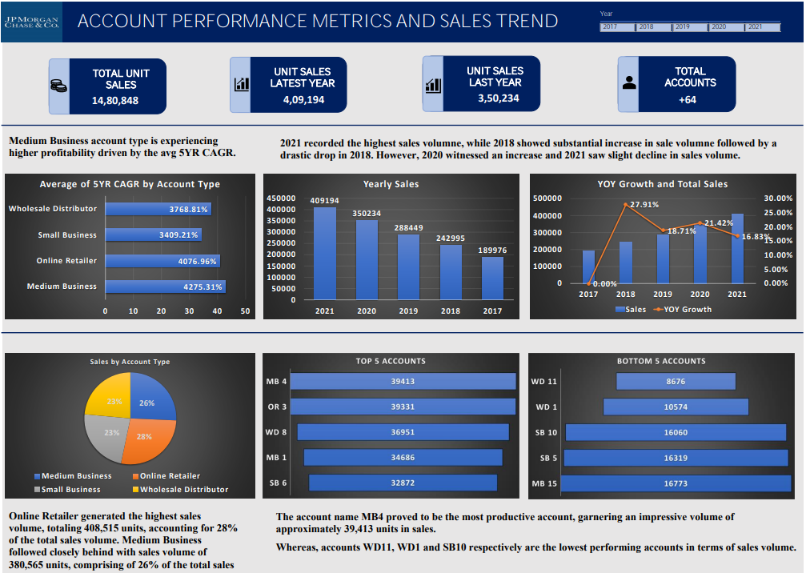
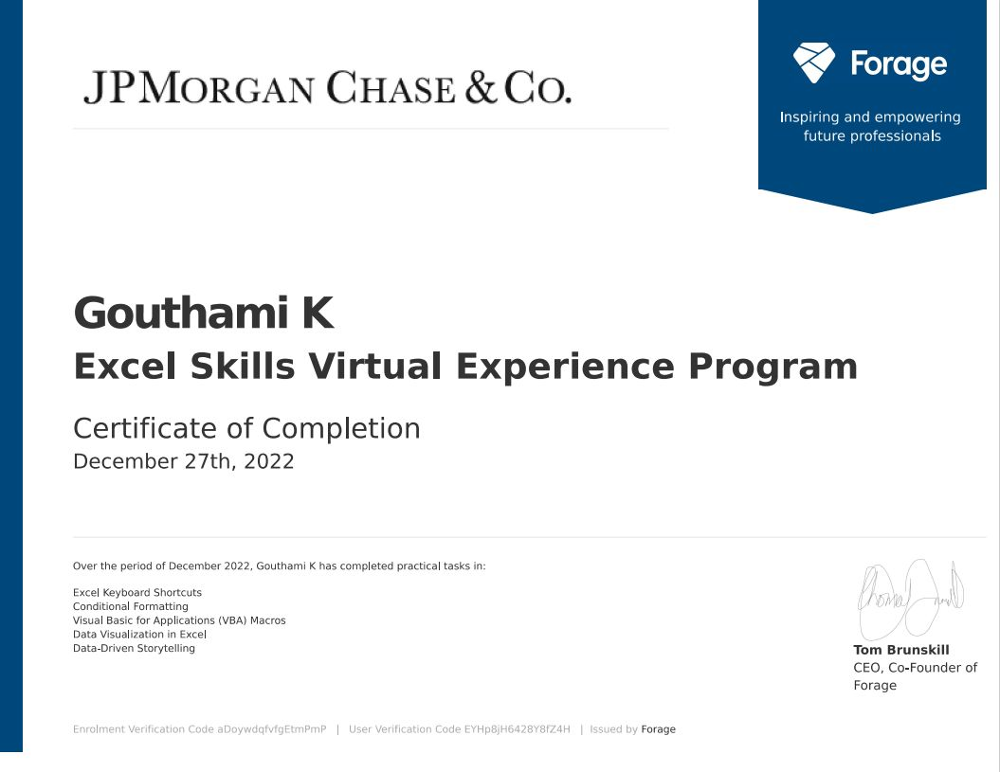

# JPMorgan Chase & Co.:Excel skills virtual experience program
The internship included 5 tasks:
## Excel Keyboard Shortcuts
The task is to learn some key Excel shortcuts, practice them in Excel, and then take the 6 multiple-choice questions quiz.  

## Conditional Formatting
The task is to use Excel’s conditional formatting tools to explore and visualize the characteristics of the data in the dataset provided.\
We use the conditional formatting tools (either the menu-based tools or write our own conditional formatting formulas) to do the following explorations of the data:

● Highlight any cells with formula errors in purple with white text.\
● Highlight any cells with missing values in yellow.\
● Identify accounts that have not been cross-sold with Product 2 by highlighting the appropriate Product 2 cells in orange.\
● Identify accounts that have a 5-year sales CAGR of at least 100% by highlighting the appropriate CAGR cells in green and any accounts with a negative CAGR in red with    white text.\
● Identify accounts in the top 10% of unit sales for 2021 by highlighting the appropriate 2021 unit sales cells in blue.

## Visual Basic for Applications (VBA) Macros
Visual Basic for Applications (VBA) is a useful language to learn and skill to develop. Like any programming language, VBA has its own vocabulary, syntax, and commands to learn. With VBA, we can write sophisticated programs that exceed tasks one could do manually on the keyboard and mouse. While becoming skilled at writing complex VBA programs takes many hours of training, we can learn in just a few minutes to create simple macros to automate common, repetitive tasks in Excel.  

Excel has two methods built-in for creating macros. The easiest way is to “record” the macro, which means telling Excel to “watch” our actions as we do a task using the keyboard and mouse and automatically create a list of commands in VBA that correspond to those actions. Then, we can tell Excel to automatically run that list of commands over and over as needed. That list or script of commands is our macro, and we can assign it to a button on the screen to run it at will. The other method for creating macros is to write the list of commands (the VBA code) ourself without having Excel watch our actions and generate that list for you.  

The task is to familiarize with recording and using simple macros in Excel, and then create two macros using the same dataset as that of Task1.
Then, create two macros and associate them with buttons we add to our spreadsheet.\
● A macro to sort the entire spreadsheet by 5 YR CAGR in descending order to see which accounts have the highest overall 5-year sales growth\
● A macro to sort the entire spreadsheet by 2021 unit sales in descending order to see which accounts have the highest overall unit sales in 2021

When we are finished, you will have two buttons that let you very quickly and easily see two ways of analyzing account sales data to inform account planning and other operational decision-making and quickly switch between them.  
 
## Data Visualization in Excel
The task is to create a simple dashboard using the account sales dataset we worked with in prior tasks. 

Considering the dataset we do the following:\
● What charts and graphs would be useful related to this data?\
● Unit sales by year?\
● Top 10 accounts by unit sales or CAGR?\
● Effectiveness of different marketing programs by the number of sales driven?\
● Sales by account type?

The important part of this exercise is to begin thinking in the mindset of using dashboards to tell the story of our data and support the data-driven business decisions that relate to the data.

 

## Data-Driven Storytelling 
The task is to write a short PowerPoint presentation to communicate key insights and data from the analysis and visualization work in the prior task.\
From that work, we have insights into which accounts are and are not performing well, how sales are growing year over year, which account types are selling more units than others, and other kinds of findings that we could communicate. 

## Certification
Congratulations! I have obtained the certification.

  

